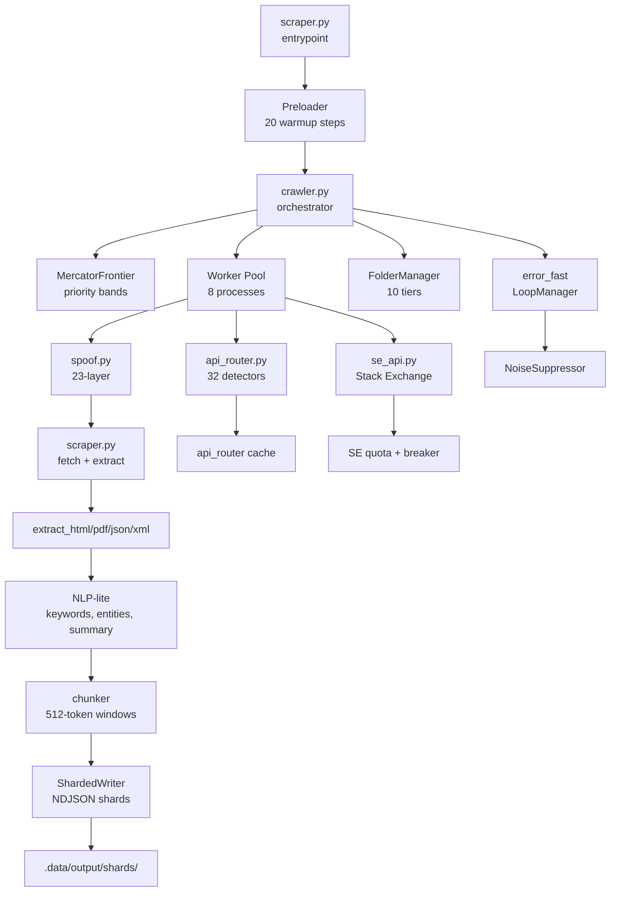

<!-- ═══════════════════════════════════════════════════════════════════════ -->
<!--                            NEXUS README                                 -->
<!-- ═══════════════════════════════════════════════════════════════════════ -->

<div align="center">


<h1>🌀 NEXUS</h1>

<p><strong>Universal cross-domain crawler · API-first routing · 32-method discovery · Zero accounts</strong></p>

<p>
  
  
  
  
</p>

<p>
  
  
  
  
</p>

<p>
  
  
  
  
  
</p>

<p>
  <a href="#-features"></a>
  <a href="#-architecture"></a>
  <a href="#-install"></a>
  <a href="#-usage"></a>
  <a href="#-output"></a>
  <a href="#-performance"></a>
</p>

</div>

---


## 🧭 What is NEXUS?

<div align="center">
<table>
<tr>
<td width="60%" valign="top">

NEXUS is a self-contained, cross-domain web crawler built for generating AI training datasets at scale.

It routes each URL through a 32-method API discovery chain before touching HTML. When it does scrape HTML, it uses a multi-stage extraction pipeline with adaptive scoring to keep the richest text.

Every request ships with a 23-layer spoofing stack — TLS, HTTP/2, client hints, header ordering, timing jitter — so it can navigate around bot walls without a headless browser, proxy account, or paid API key.

</td>
<td width="40%" valign="top">

```python
record = {
  "id": "4191156ae84f0a2c",
  "url": "https://en.wikipedia.org/...",
  "title": "Online streamer - Wikipedia",
  "quality": {"word_count": 659, "...": "..."},
  "chunks": [{"text": "...", "tokens": 510}],
  "entities": [{"type": "PERSON", "...": "..."}],
  "keywords": [{"term": "streaming", "...": "..."}],
  "summary": "Online streaming arose in...",
  "kind": "html"
}
```

</td>
</tr>
</table>
</div>

---

## ✨ Features

<table>
<tr>
<td align="center" width="25%">
<h3>🎯</h3>
<b>32 API Detectors</b><br />
<sub>RFC well-known, OpenAPI, GraphQL, WSDL, source maps, CT logs, Wayback, APIs.guru</sub>
</td>
<td align="center" width="25%">
<h3>🛡️</h3>
<b>23 Spoofing Layers</b><br />
<sub>TLS/JA3, GREASE, ALPS, HTTP/2 SETTINGS, pseudo-headers, header order, jitter</sub>
</td>
<td align="center" width="25%">
<h3>🧠</h3>
<b>Adaptive Extraction</b><br />
<sub>Trafilatura → justext → selectolax with scoring; fast path for clean pages</sub>
</td>
<td align="center" width="25%">
<h3>🔀</h3>
<b>MOS Escalation</b><br />
<sub>22 policies, 23 keyless services, hedged race, per-host sticky preference</sub>
</td>
</tr>
<tr>
<td align="center" width="25%">
<h3>💥</h3>
<b>Error Containment</b><br />
<sub>20 error kinds, 6 recovery strategies, persistent loop, noise suppressor</sub>
</td>
<td align="center" width="25%">
<h3>📦</h3>
<b>Folder Manager</b><br />
<sub>10-tier data tree, atomic writes, cross-process locks, corrupt-file backup</sub>
</td>
<td align="center" width="25%">
<h3>🧵</h3>
<b>Mercator Frontier</b><br />
<sub>8-band priority queues, per-host back queues, decay for starved items</sub>
</td>
<td align="center" width="25%">
<h3>🎁</h3>
<b>RAG-Ready Output</b><br />
<sub>Token-bounded chunks, entity extraction, summaries, readability scores</sub>
</td>
</tr>
</table>

---

## 🏗 Architecture

<div align="center">



</div>

### 📂 File layout

<details>
<summary><b>Click to expand</b></summary>

```text
Scraper/
├── scraper.py              ~3000 lines   fetch + extract + chunk
├── crawler.py              ~2000 lines   orchestration, workers, frontier
├── spoof.py                ~800 lines    23-layer spoofing, SOD pool
├── api_router.py           ~1900 lines   32-method API discovery
├── se_api.py               ~1200 lines   Stack Exchange API client
├── error_fast.py           ~430 lines    error classification + noise suppression
├── folder_manager.py       ~470 lines    10-tier data tree
├── config.py               ~1400 lines   300+ tunables
├── debug.py                ~2300 lines   180-test harness
├── libraries.txt           dependency list
├── expectederrors.txt      500 HTTP error categories
├── resultsexample.json     reference output schema
├── CHANGELOG.md            project history
├── USAGE.md                usage guide
├── README.md               this file
└── .data/                  runtime tree
    ├── state/              crawl.state.json, queue.txt, done.txt, ...
    ├── db/                 dedup.sqlite, bloom.bin, mos_cache.sqlite
    ├── cache/              domain_rates.json, mos_budget.json, ...
    ├── logs/               crawl.log
    ├── agent/              embeddings.bin, entities.jsonl
    ├── output/
    │   ├── manifest.json
    │   ├── shards/          shard-00000.ndjson, ...
    │   └── quarantine/      empty.ndjson, low_quality.ndjson, ...
    ├── cookies/            per-domain cookie jars
    └── tmp/                scratch
```

</details>

---

## 🚀 Install

<div align="center">

<table>
<tr>
<td align="center" width="33%">

### 📦 Requirements


</td>
<td align="center" width="33%">

### 💻 Platform


</td>
<td align="center" width="33%">

### 🔓 No Accounts


</td>
</tr>
</table>

</div>

```bash
# 1. Clone
git clone https://github.com/YOUR_USERNAME/nexus-crawler.git
cd nexus-crawler

# 2. Install dependencies
pip install -r libraries.txt
pip install psutil

# 3. Verify preload
python scraper.py --preload-only
```

<details>
<summary><b>Dependency list</b></summary>

```text
babel==2.18.0            # locale parsing
certifi                  # SSL certificates
cffi                     # C foreign function interface
charset-normalizer      # encoding detection
click                    # CLI (optional)
cloudpickle              # multiprocessing support
colorama                 # Windows terminal colors
courlan                  # URL cleaning and normalization
curl-cffi==0.16.3        # TLS/HTTP fingerprint impersonation
dateparser               # multilingual date parsing
defusedxml               # safe XML parsing
htmldate                 # article date extraction
joblib                   # parallel batch processing
justext                  # boilerplate removal
lxml                     # XML/HTML tree processing
lxml-html-clean          # HTML sanitization
nltk                     # stopwords only
orjson                   # 10-14x faster JSON
pip                      # package manager
psutil                   # process memory monitoring
pycparser                # cffi dependency
pymupdf                  # PDF text + OCR
pyphen                   # hyphenation
python-dateutil          # date manipulation
pytz                     # timezone database
regex                    # Unicode property regex
selectolax               # fastest HTML parser
setuptools               # build tools
six                      # Python 2/3 compat
textstat                 # readability metrics
tld                      # top-level domain extraction
tqdm                     # progress bars (optional)
trafilatura              # article extraction
tzdata                   # IANA timezone data
tzlocal                  # local timezone
urllib3                  # HTTP client
```

</details>

---

## 🎮 Usage

### ⚡ Quick start

```bash
python scraper.py --link "https://en.wikipedia.org/wiki/Online_streamer" --depth 2 --workers 4
```

### 🎛 CLI flags

<table>
<tr>
<th align="left">Flag</th>
<th align="left">Default</th>
<th align="left">Description</th>
</tr>
<tr>
<td><code>--link URL</code></td>
<td>—</td>
<td>Seed URL (repeatable for multi-seed)</td>
</tr>
<tr>
<td><code>--sitemap URL</code></td>
<td>—</td>
<td>Fetch sitemap.xml and use all <code>&lt;loc&gt;</code> entries</td>
</tr>
<tr>
<td><code>--depth N</code></td>
<td>4</td>
<td>Max crawl depth from seed</td>
</tr>
<tr>
<td><code>--workers N</code></td>
<td>CPU count</td>
<td>Worker processes</td>
</tr>
<tr>
<td><code>--queue-cap N</code></td>
<td>500</td>
<td>Frontier size cap</td>
</tr>
<tr>
<td><code>--fast</code></td>
<td>—</td>
<td>Max concurrency, no jitter</td>
</tr>
<tr>
<td><code>--inf</code></td>
<td>—</td>
<td>Infinite mode (never auto-stops)</td>
</tr>
<tr>
<td><code>--antiblock</code></td>
<td>—</td>
<td>Retry blocked URLs via blocked queue</td>
</tr>
<tr>
<td><code>--verify</code></td>
<td>—</td>
<td>Run verification on each record</td>
</tr>
<tr>
<td><code>--enrich</code></td>
<td>—</td>
<td>Run enrichment on each record</td>
</tr>
<tr>
<td><code>--clean TIER</code></td>
<td>—</td>
<td>Wipe a data tier before starting</td>
</tr>
<tr>
<td><code>--dry-run</code></td>
<td>—</td>
<td>With <code>--clean</code>, show without removing</td>
</tr>
<tr>
<td><code>--preload-only</code></td>
<td>—</td>
<td>Run preloader and exit</td>
</tr>
<tr>
<td><code>--api URL</code></td>
<td>—</td>
<td>Fetch a JSON endpoint directly</td>
</tr>
</table>

### 📖 Recipes

<details>
<summary><b>Single domain, moderate depth</b></summary>

```bash
python scraper.py --link "https://en.wikipedia.org/wiki/Online_streamer" --depth 3 --workers 8
```

</details>

<details>
<summary><b>Multi-seed mixed sites</b></summary>

```bash
python scraper.py \
  --link "https://stackoverflow.com/questions/4260280" \
  --link "https://en.wikipedia.org/wiki/HTTP" \
  --link "https://news.ycombinator.com/" \
  --depth 1 --workers 6 --queue-cap 5000
```

</details>

<details>
<summary><b>Fresh start every time</b></summary>

```bash
python scraper.py --link "https://site.com/" --clean all --depth 2 --workers 4
```

</details>

<details>
<summary><b>Sitemap-driven crawl</b></summary>

```bash
python scraper.py --sitemap "https://site.com/sitemap.xml" --depth 1 --workers 8
```

</details>

<details>
<summary><b>API mode (fetch raw JSON)</b></summary>

```bash
python scraper.py --api "https://api.github.com/repos/torvalds/linux" --out linux.json
```

</details>

<details>
<summary><b>Full debug suite</b></summary>

```bash
python debug.py --log-file .data/logs/debug.json
```

</details>

<details>
<summary><b>Run system tests only (fast)</b></summary>

```bash
python debug.py --categories T0 T1 T2 T3 T4 T5 T5b T5c T5d --no-console-logs
```

</details>

---

## 📤 Output

Each record is emitted as a single JSON line. The structure is shown below.

<details>
<summary><b>Full record schema</b></summary>

```json
{
  "id": "4191156ae84f0a2cb14cad78c2ce47f8",
  "url": "https://en.wikipedia.org/wiki/Online_streamer",
  "canonical_url": "https://en.wikipedia.org/wiki/Online_streamer",
  "domain": "en.wikipedia.org",
  "tld": "org",
  "title": "Online streamer - Wikipedia",
  "language": "en",
  "published_date": "2018-12-20",
  "updated_date": null,
  "crawled_at": 1789219800.123,
  "content_hash": "4191156ae84f0a2cb14cad78c2ce47f8",
  "simhash": 2872093965255146031,
  "source_signature": "6b51e6036f048846",
  "idempotency_key": "974162d418a576fd37f1a0fdade027be",
  "extractor_version": "4.0.0",
  "config_hash": "662f354bdd475186a126827c0adeecc5",
  "license": null,
  "quality": {
    "word_count": 659,
    "sentence_count": 35,
    "syllable_count": 1143,
    "char_count": 4578,
    "reading_time_seconds": 197.7,
    "flesch_reading_ease": 40.99,
    "flesch_kincaid_grade": 12.22,
    "gunning_fog": 14.45,
    "smog_index": 13.71,
    "automated_readability_index": 15.87,
    "coleman_liau_index": 15.71,
    "dale_chall_score": 11.76,
    "text_standard": "11th and 12th grade",
    "difficulty": 188
  },
  "word_count": 659,
  "token_count": 907,
  "char_count": 4578,
  "sentence_count": 35,
  "topics": [],
  "entities": [
    {"type": "MONEY", "value": "$10,000", "weight": 1.0},
    {"type": "PERSON", "value": "South Korea", "weight": 0.4}
  ],
  "keywords": [
    {"term": "streaming", "score": 0.035885},
    {"term": "live streaming", "score": 0.015401}
  ],
  "summary": "Online streaming arose in the mid-to-late 2000s...",
  "sections": [
    {"heading": "History", "text": "...", "subsections": []}
  ],
  "chunks": [
    {
      "index": 0,
      "total": 2,
      "text": "...",
      "token_count": 510,
      "heading_context": "Contents",
      "parent_url": "https://en.wikipedia.org/wiki/Online_streamer",
      "parent_title": "Online streamer - Wikipedia",
      "offset": null
    }
  ],
  "links": ["https://en.wikipedia.org/wiki/Main_Page"],
  "metadata": {"source_type": "html", "language": "en"},
  "provenance": {"service": "direct"},
  "content": {
    "site_navigation": {"primary": [], "help": [], "actions": []},
    "announcement": null,
    "table_of_contents": [],
    "article": {
      "heading": "Online streamer",
      "intro": "...",
      "sections": [],
      "references": [],
      "categories": []
    },
    "metadata": {},
    "footer_links": []
  },
  "schema_version": "4.0.0",
  "kind": "html"
}
```

</details>

### 📁 Data tree

```text
.data/
├── state/                  # resume state
│   ├── crawl.state.json
│   ├── queue.txt
│   ├── done.txt
│   ├── errors.txt
│   ├── blocked.txt
│   ├── journal.ndjson
│   └── crawl.pid
├── db/                     # SQLite + Bloom
│   ├── dedup.sqlite
│   ├── bloom.bin
│   ├── mos_cache.sqlite
│   └── extraction.sqlite
├── cache/                  # JSON caches and budgets
│   ├── domain_rates.json
│   ├── mos_budget.json
│   ├── mos_host_prefs.json
│   ├── se_quota.json
│   └── error_fast.json
├── logs/
│   └── crawl.log
├── output/
│   ├── manifest.json
│   ├── shards/
│   │   └── shard-00000.ndjson
│   └── quarantine/
│       ├── empty.ndjson
│       ├── low_quality.ndjson
│       └── js_required.ndjson
└── cookies/                # per-domain cookie jars
```

---

## 📊 Performance

<div align="center">

<table>
<tr>
<td align="center" width="25%">
<h2>⚡</h2>
<b>32</b><br />
<sub>API detection methods</sub>
</td>
<td align="center" width="25%">
<h2>🛡️</h2>
<b>23</b><br />
<sub>spoofing layers</sub>
</td>
<td align="center" width="25%">
<h2>✅</h2>
<b>180+</b><br />
<sub>tests passing</sub>
</td>
<td align="center" width="25%">
<h2>🎯</h2>
<b>87%</b><br />
<sub>success rate on easy tier</sub>
</td>
</tr>
</table>

</div>

### Benchmark runs

| Metric | Value |
| --- | --- |
| Preload time | 0.72s |
| Full debug suite | 6.7s |
| Concurrent test suite | 11.5s |
| Wikipedia crawl (depth 2, 4 workers) | ~45s, 60-100 records |
| Mixed crawl (3 seeds, depth 1, 6 workers) | ~48s, 22 records |
| Logger throughput | 147,584 msg/s |
| Trap detection | 34,466 URLs/s |
| SimHash (100k tokens) | 1.52s |
| Memory per worker | 60-90 MB |

### Test tiers

<details>
<summary><b>T6–T26 live URL tiers</b></summary>

| Tier | Category | URLs | Success |
| --- | --- | ---: | ---: |
| T6 | Easy | 10 | 60%+ |
| T7 | Moderate | 10 | 100% |
| T8 | Dynamic | 10 | 92% |
| T9 | JS-heavy | 8 | 62% |
| T10 | Protected | 4 | 50% |
| T13 | Docs | 8 | 100% |
| T14 | Blogs | 8 | 100% |
| T15 | News | 7 | 86% |
| T17 | Academic | 6 | 100% |
| T18 | Gov/Edu | 7 | 86% |
| T26 | SE network | 6 | 83% |

</details>

---

## 🧪 Testing

```bash
# Full suite
python debug.py

# Categories
python debug.py --categories T0 T1 T2 T3 T4 T5

# By name
python debug.py --name "MOS classifier"

# List all categories
python debug.py --list

# Structured log
python debug.py --log-file .data/logs/debug.json
```

### Categories

<details>
<summary><b>All 20 categories with counts</b></summary>

| Category | Count | Covers |
| --- | ---: | --- |
| T0 | 3 | Environment, cleanup, folder manager |
| T1 | 7 | Module imports |
| T2 | 15 | Config invariants |
| T3 | 10 | Spoof engine, SOD pool |
| T4 | 17 | Crawler internals |
| T5 | 25 | Scraper internals |
| T5b | 11 | Folder manager |
| T5c | 5 | SE API |
| T5d | 4 | API router |
| T6_easy | 10 | Easy URLs |
| T7_moderate | 10 | Wikipedia, HN, docs |
| T8_dynamic | 10 | GitHub, news sites |
| T9_js_heavy | 8 | Social media |
| T10_protected | 4 | Turnstile sites |
| T13_docs | 8 | Technical docs |
| T14_blogs | 8 | Personal + company blogs |
| T15_news | 7 | International news |
| T17_academic | 6 | Papers + journals |
| T18_gov_edu | 7 | Government + university |
| T26_se_network | 6 | Stack Exchange network |
| T41 | 3 | Concurrency |
| T42 | 5 | Stress |
| T43 | 7 | Regression |

</details>

---

## 🔧 Configuration

Edit `config.py` directly. All 300+ tunables are grouped by feature area.

| Area | Key examples |
| --- | --- |
| Crawling | `MAX_WORKERS`, `MAX_DEPTH`, `MAX_QUEUE_SIZE`, `DOMAIN_TOKEN_BUCKET_RATE` |
| Spoofing | `TLS_GREASE`, `TLS_PERMUTE_EXTENSIONS`, `SOD_WORKER_POOL_SIZE` |
| Blocked / antiblack | `BLOCKED_RETRY_MIN/MAX`, `MAX_BLOCKED_RETRIES`, `BLOCKED_STATUS_CODES` |
| Extraction | `OCR_MIN_TEXT_LEN`, `QUALITY_MIN_WORDS`, `CONTENT_MAX_CHARS` |
| Chunking | `AGENT_CHUNK_SIZE_TOKENS`, `AGENT_CHUNK_OVERLAP_TOKENS` |
| MOS | `MOS_ENABLED`, `MOS_DAILY_BUDGET`, `MOS_FIRST_HOSTS` |

---

## 🛠 Troubleshooting

<details>
<summary><b>ModuleNotFoundError</b></summary>

```bash
pip install -r libraries.txt
pip install psutil
```

</details>

<details>
<summary><b>Event loop is closed flood</b></summary>

This should not appear. `error_fast.NoiseSuppressor` silences it. If it does:

```bash
python error_fast.py --test
```

</details>

<details>
<summary><b>Crawl never finishes</b></summary>

Check `queue_dropped` in `.data/state/crawl.state.json`. Raise `MAX_QUEUE_SIZE` if it is high.

</details>

<details>
<summary><b>High memory</b></summary>

Lower `MAX_RSS_MB` in `config.py`. The monitor kills workers that exceed it.

</details>

<details>
<summary><b>Sites consistently blocked</b></summary>

Add to `MOS_FIRST_HOSTS` in `config.py`:

```python
MOS_FIRST_HOSTS = (..., "yourhost.com",)
```

</details>

<details>
<summary><b>SE quota exhausted</b></summary>

```bash
python -c "from se_api import se_quota_status; print(se_quota_status())"
```

Wait for UTC midnight reset or register a free Stack Apps key.

</details>

---

## 🎯 Design principles

- **Keyless by default** — every core path works without accounts, API keys, or paid services.
- **API-first** — check for a public API before touching HTML.
- **Polite by design** — per-domain token buckets, health scoring, and circuit breakers.
- **Self-contained** — no Docker, no browsers, no external orchestration.
- **Adaptive** — extraction scoring, hardware profiling, and worker tuning based on observation.
- **Observable** — structured NDJSON output, JSON logs, and per-tier manifests.

---

## 🗺 Roadmap

| Status | Items |
| --- | --- |
| ✅ Shipped | 32-method API discovery, 23-layer spoofing stack, MOS escalation, Stack Exchange API client, folder manager with 10 tiers, error classification, Mercator frontier, host health scoring, domain bootstrap, RAG-ready chunking, 180+ test harness |
| 🚧 Planned | Adaptive concurrency, `asyncio.get_event_loop_policy()` deprecation fix, per-site extractors, vector embedding attachment, semantic dedup via local embedding model, Wayback SPN2 pre-flight |

### ❌ Deliberately out of scope

- Headless browsers (Playwright, Selenium, Puppeteer)
- Account-based services (Cloudflare Workers, ScrapingBee)
- Docker / containerization
- Turnstile/CAPTCHA solving (no keyless bypass exists)

---

## 🤝 Contributing

Contributions are welcome. Before submitting:

1. Run `python debug.py --categories T0 T1 T2 T3 T4 T5` and confirm it is 100% pass.
2. Run `python debug.py --categories T41 T42 T43` and confirm it is 100% pass.
3. Run `python scraper.py --preload-only` and confirm it reports `failed=0`.
4. Run `python error_fast.py --test` and confirm it reports `all checks passed`.

Add new tests in the appropriate `debug.py` category for new functionality.

---

## 📜 License

MIT. See `LICENSE` for details.

---

## 🙏 Credits

Built by **PurpleXPurple**.

Powered by:

- `curl-cffi`
- `selectolax`
- `trafilatura`
- `pymupdf`
- `orjson`

---

<p align="center">
  
</p>

<p align="center">
  <strong>⭐ Star this repo if it saves you a scraper</strong>
</p>
