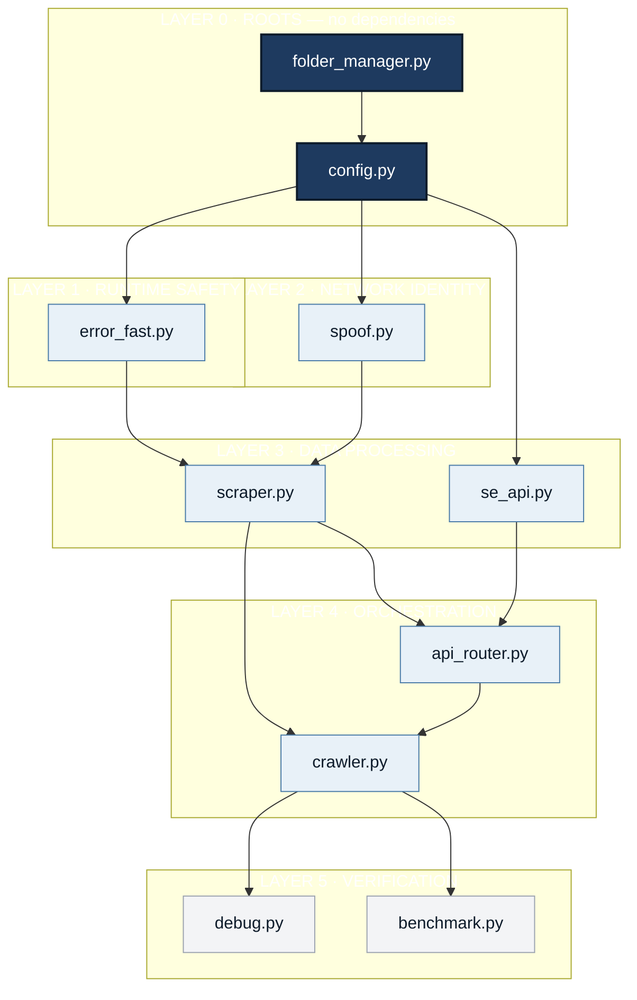
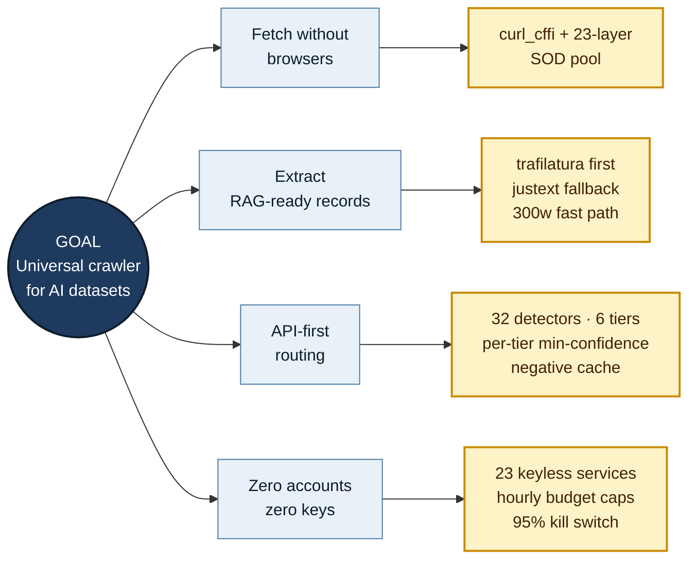
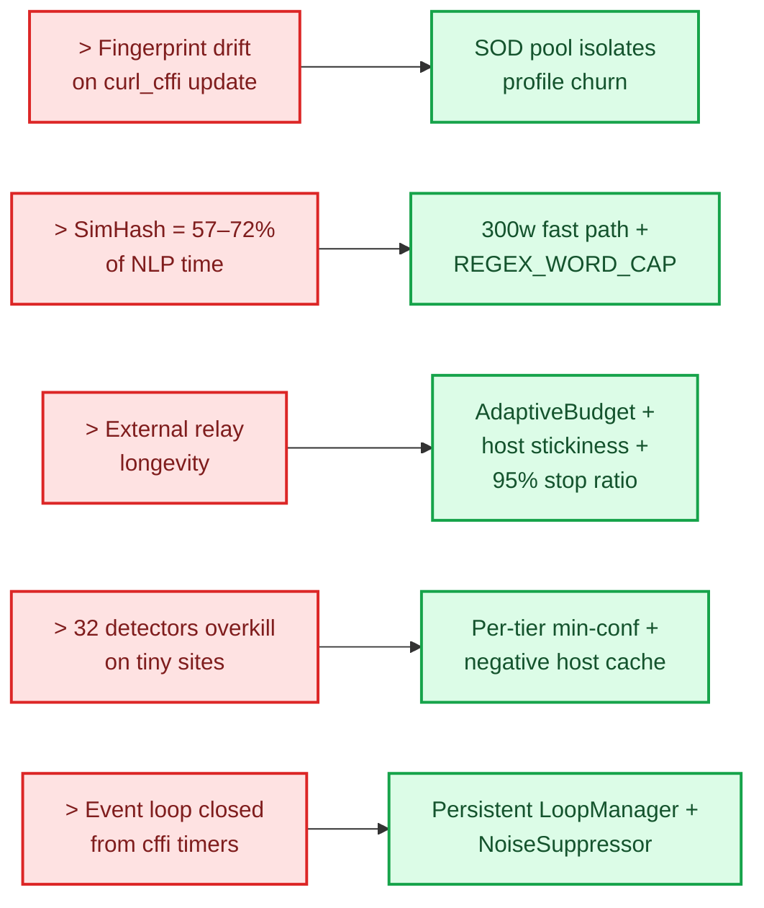
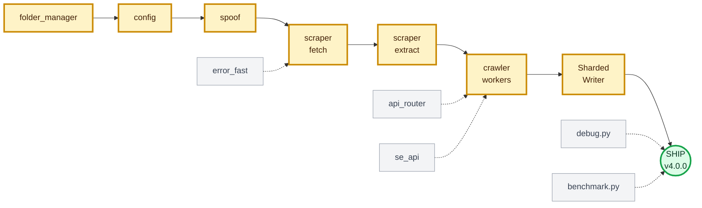
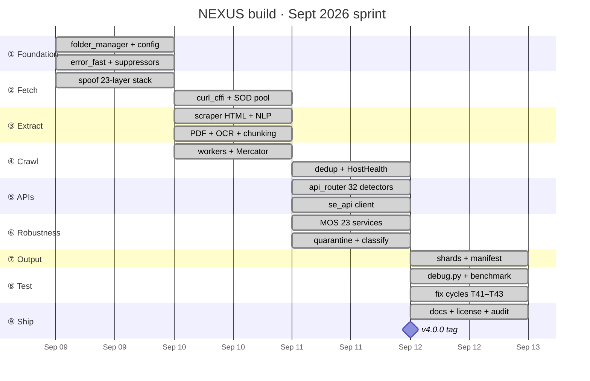

# NEXUS · Refactored Skeleton

**What changed:** removed cross-cutting edges, normalized direction (TB for hierarchy, LR for sequence), fixed subgraph chaining, unified color semantics, split overloaded diagrams. Every graph now answers **one question**.

---

## LEGEND

| Color | Meaning | Shape | Meaning |
|---|---|---|---|
| Dark blue `#1e3a5f` | Phase / Goal | `(( ))` | Endpoint |
| Light blue `#e8f1f8` | Module / File | `[ ]` | Component |
| Yellow `#fef3c7` | Critical path | `{ }` | Decision |
| Red `#fee2e2` | Risk | `> ]` | Risk flag |
| Green `#dcfce7` | Shipped / Evidence | `( )` | Milestone |
| Grey `#f3f4f6` | Off-path | | |

---

## 1 · MASTER ROADMAP · 0% → 100%

```mermaid
flowchart TB
    classDef start fill:#0f172a,color:#fff,stroke:#000,stroke-width:3px
    classDef file fill:#dbeafe,color:#1e3a5f,stroke:#2563eb,stroke-width:2px
    classDef sub fill:#f1f5f9,color:#334155,stroke:#94a3b8
    classDef data fill:#fef3c7,color:#422006,stroke:#ca8a04,stroke-width:2px
    classDef ship fill:#dcfce7,color:#14532d,stroke:#16a34a,stroke-width:4px
    classDef risk fill:#fee2e2,color:#7f1d1d,stroke:#dc2626,stroke-width:2px

    START(("START<br/>0%")):::start

    subgraph P0["① FOUNDATION · 0-5%"]
        P0_FM["folder_manager.py"]:::file
        P0_FM1["tier tree · 10 dirs"]:::sub
        P0_FM2["atomic_write · fsync"]:::sub
        P0_FM3["FileLock · O_EXCL"]:::sub
        P0_FM4["Diagnostics · 14 checks"]:::sub
        P0_FM5["migrate_legacy"]:::sub

        P0_CFG["config.py"]:::file
        P0_CFG1["CONCURRENCY · workers / rate"]:::sub
        P0_CFG2["NETWORK · timeouts / jitter"]:::sub
        P0_CFG3["SPOOF · TLS + HTTP2 knobs"]:::sub
        P0_CFG4["MOS · 22 policies"]:::sub
        P0_CFG5["BROWSER_PROFILES · 8"]:::sub
        P0_CFG6["STORAGE PATHS · all tiers"]:::sub
        P0_CFG7["300+ tunables"]:::sub

        P0_EF["error_fast.py"]:::file
        P0_EF1["Kind enum · 20 kinds"]:::sub
        P0_EF2["classify · 25 regex"]:::sub
        P0_EF3["NoiseSuppressor · cffi"]:::sub
        P0_EF4["LoopManager · persistent"]:::sub
        P0_EF5["@fast_catch · @retry · swallow"]:::sub

        P0_FM --> P0_FM1
        P0_FM --> P0_FM2
        P0_FM --> P0_FM3
        P0_FM --> P0_FM4
        P0_FM --> P0_FM5
        P0_CFG --> P0_CFG1
        P0_CFG --> P0_CFG2
        P0_CFG --> P0_CFG3
        P0_CFG --> P0_CFG4
        P0_CFG --> P0_CFG5
        P0_CFG --> P0_CFG6
        P0_CFG --> P0_CFG7
        P0_EF --> P0_EF1
        P0_EF --> P0_EF2
        P0_EF --> P0_EF3
        P0_EF --> P0_EF4
        P0_EF --> P0_EF5
        P0_FM4 -.-> P0_CFG6
        P0_CFG5 -.-> P0_EF4
    end

    subgraph P1["② FETCH · 5-15%"]
        P1_SP["spoof.py"]:::file
        P1_SP1["8 browser profiles"]:::sub
        P1_SP2["23-layer stack · TLS+HTTP2+App"]:::sub
        P1_SP3["SODPool · 16 workers"]:::sub
        P1_SP4["header order · chrome/ff/safari"]:::sub
        P1_SP5["_enforce_consistency"]:::sub
        P1_SP6["rotate_fingerprint"]:::sub
        P1_SP7["jitter · 0.7-2.4s / fast 0-0.05s"]:::sub

        P1_CC["curl_cffi 0.16.3"]:::file
        P1_CC1["JA3 / JA4 match"]:::sub
        P1_CC2["ALPS · GREASE · cert-comp"]:::sub
        P1_CC3["HTTP2 SETTINGS · pseudo-order"]:::sub
        P1_CC4["Akamai string · 4-part"]:::sub
        P1_CC5["AsyncSession pool · max_clients"]:::sub

        P1_SP --> P1_SP1
        P1_SP --> P1_SP2
        P1_SP --> P1_SP3
        P1_SP --> P1_SP4
        P1_SP --> P1_SP5
        P1_SP --> P1_SP6
        P1_SP --> P1_SP7
        P1_CC --> P1_CC1
        P1_CC --> P1_CC2
        P1_CC --> P1_CC3
        P1_CC --> P1_CC4
        P1_CC --> P1_CC5
        P1_SP2 -.-> P1_CC4
        P1_SP3 -.-> P1_CC5
    end

    subgraph P2["③ EXTRACT · 15-30%"]
        P2_SC["scraper.py"]:::file
        P2_SC1["_clean_html · Cleaner"]:::sub
        P2_SC2["_trafilatura_extract"]:::sub
        P2_SC3["_justext_extract"]:::sub
        P2_SC4["_selectolax_extract"]:::sub
        P2_SC5["_extraction_score · 8 factors"]:::sub
        P2_SC6["_adaptive_extract_text · 300w fast"]:::sub
        P2_SC7["extract_html"]:::sub
        P2_SC8["extract_pdf · pymupdf + OCR"]:::sub
        P2_SC9["extract_json / xml / text"]:::sub
        P2_SC10["chunk_text · 512 tok / 64 overlap"]:::sub
        P2_SC11["extract_keywords · TF-IDF"]:::sub
        P2_SC12["extract_entities · v2 + freq filter"]:::sub
        P2_SC13["summarize · extractive"]:::sub
        P2_SC14["_quality_metrics · 12 keys"]:::sub
        P2_SC15["redact_pii · 5 types"]:::sub
        P2_SC16["_base_record · 44 fields"]:::sub

        P2_PL["Preloader · 21 steps"]:::file
        P2_PL1["warm regexes + stopwords"]:::sub
        P2_PL2["warm trafilatura + justext"]:::sub
        P2_PL3["warm textstat + pymupdf"]:::sub
        P2_PL4["warm api_router + se_api"]:::sub

        P2_SC --> P2_SC1
        P2_SC --> P2_SC2
        P2_SC --> P2_SC3
        P2_SC --> P2_SC4
        P2_SC --> P2_SC5
        P2_SC --> P2_SC6
        P2_SC --> P2_SC7
        P2_SC --> P2_SC8
        P2_SC --> P2_SC9
        P2_SC --> P2_SC10
        P2_SC --> P2_SC11
        P2_SC --> P2_SC12
        P2_SC --> P2_SC13
        P2_SC --> P2_SC14
        P2_SC --> P2_SC15
        P2_SC --> P2_SC16
        P2_PL --> P2_PL1
        P2_PL --> P2_PL2
        P2_PL --> P2_PL3
        P2_PL --> P2_PL4
        P2_SC6 -.-> P2_SC5
        P2_SC7 -.-> P2_SC16
    end

    subgraph P3["④ CRAWL · 30-45%"]
        P3_CR["crawler.py"]:::file
        P3_CR1["mp spawn workers"]:::sub
        P3_CR2["MercatorFrontier · 8 band"]:::sub
        P3_CR3["HostHealth · 0.0-1.0 score"]:::sub
        P3_CR4["DomainTracker · token bucket"]:::sub
        P3_CR5["YieldTracker · 500 window"]:::sub
        P3_CR6["DomainBootstrap · sitemap/feed"]:::sub
        P3_CR7["DedupStore · SQLite WAL"]:::sub
        P3_CR8["BloomFilter · 2^27 bits"]:::sub
        P3_CR9["SimHash64 + MinHash"]:::sub
        P3_CR10["DeadLetterQueue"]:::sub
        P3_CR11["_detect_trap · 6 rules"]:::sub
        P3_CR12["ChangeDetector · ETag"]:::sub
        P3_CR13["ShardedWriter · 50k / shard"]:::sub
        P3_CR14["QuarantineWriter"]:::sub
        P3_CR15["_write_manifest"]:::sub
        P3_CR16["AdaptiveConcurrency"]:::sub

        P3_CR --> P3_CR1
        P3_CR --> P3_CR2
        P3_CR --> P3_CR3
        P3_CR --> P3_CR4
        P3_CR --> P3_CR5
        P3_CR --> P3_CR6
        P3_CR --> P3_CR7
        P3_CR --> P3_CR8
        P3_CR --> P3_CR9
        P3_CR --> P3_CR10
        P3_CR --> P3_CR11
        P3_CR --> P3_CR12
        P3_CR --> P3_CR13
        P3_CR --> P3_CR14
        P3_CR --> P3_CR15
        P3_CR --> P3_CR16
        P3_CR2 -.-> P3_CR5
        P3_CR7 -.-> P3_CR8
        P3_CR7 -.-> P3_CR9
        P3_CR3 -.-> P3_CR4
    end

    subgraph P4["⑤ API DISCOVERY · 45-55%"]
        P4_AR["api_router.py"]:::file
        P4_AR1["Hardware.profile · 4 tiers"]:::sub
        P4_AR2["AdaptiveTuner · conc/timeout"]:::sub
        P4_AR3["AdaptiveBudget · hr/day caps"]:::sub
        P4_AR4["DiscoveryCache · SQLite"]:::sub
        P4_AR5["Tier 1 · DirectHandler registry"]:::sub
        P4_AR6["Tier 2 · 6 RFC methods"]:::sub
        P4_AR7["Tier 3 · 4 HTML methods"]:::sub
        P4_AR8["Tier 4 · 6 protocol probes"]:::sub
        P4_AR9["Tier 5 · 4 JS analysis"]:::sub
        P4_AR10["Tier 6 · 12 OSINT"]:::sub

        P4_SE["se_api.py"]:::file
        P4_SE1["SE_HOST_TO_SITE · 180+"]:::sub
        P4_SE2["QuotaTracker · UTC reset"]:::sub
        P4_SE3["Breaker · per-endpoint 60s"]:::sub
        P4_SE4["Stats · rolling 500"]:::sub
        P4_SE5["se_fetch_url · full record"]:::sub
        P4_SE6["7 UA × 7 impersonate"]:::sub

        P4_AR --> P4_AR1
        P4_AR --> P4_AR2
        P4_AR --> P4_AR3
        P4_AR --> P4_AR4
        P4_AR --> P4_AR5
        P4_AR --> P4_AR6
        P4_AR --> P4_AR7
        P4_AR --> P4_AR8
        P4_AR --> P4_AR9
        P4_AR --> P4_AR10
        P4_SE --> P4_SE1
        P4_SE --> P4_SE2
        P4_SE --> P4_SE3
        P4_SE --> P4_SE4
        P4_SE --> P4_SE5
        P4_SE --> P4_SE6
        P4_SE5 -.-> P4_AR5
    end

    subgraph P5["⑥ ROBUSTNESS · 55-70%"]
        P5_MOS["MOS dispatcher"]:::file
        P5_MOS1["22-policy table"]:::sub
        P5_MOS2["23 keyless services"]:::sub
        P5_MOS3["hedged race · 800ms"]:::sub
        P5_MOS4["BudgetTracker · daily"]:::sub
        P5_MOS5["HostPreferenceCache"]:::sub
        P5_MOS6["MOSResponseCache · SQLite"]:::sub

        P5_Q["Quarantine · 10 categories"]:::file
        P5_Q1["empty / low_quality"]:::sub
        P5_Q2["js_required / extraction_error"]:::sub
        P5_Q3["language_mismatch / dup"]:::sub

        P5_CE["classify_error"]:::file
        P5_CE1["20 error kinds"]:::sub
        P5_CE2["6 recovery strategies"]:::sub
        P5_CE3["13 status-code cases"]:::sub
        P5_CE4["8 body-pattern cases"]:::sub

        P5_MOS --> P5_MOS1
        P5_MOS --> P5_MOS2
        P5_MOS --> P5_MOS3
        P5_MOS --> P5_MOS4
        P5_MOS --> P5_MOS5
        P5_MOS --> P5_MOS6
        P5_Q --> P5_Q1
        P5_Q --> P5_Q2
        P5_Q --> P5_Q3
        P5_CE --> P5_CE1
        P5_CE --> P5_CE2
        P5_CE --> P5_CE3
        P5_CE --> P5_CE4
        P5_CE3 -.-> P5_MOS1
        P5_CE4 -.-> P5_MOS1
    end

    subgraph P6["⑦ OUTPUT · 70-80%"]
        P6_OUT["data pipeline"]:::file
        P6_OUT1["ShardedWriter · 50k records"]:::sub
        P6_OUT2["Manifest · config_hash"]:::sub
        P6_OUT3["AGENT_RECORD_FIELDS · 44"]:::sub
        P6_OUT4["chunks · 512 tok / 64 overlap"]:::sub
        P6_OUT5["quality dict · 14 keys"]:::sub
        P6_OUT6["provenance · service / quota"]:::sub

        P6_OUT --> P6_OUT1
        P6_OUT --> P6_OUT2
        P6_OUT --> P6_OUT3
        P6_OUT --> P6_OUT4
        P6_OUT --> P6_OUT5
        P6_OUT --> P6_OUT6
    end

    subgraph P7["⑧ TEST · 80-90%"]
        P7_DBG["debug.py"]:::file
        P7_DBG1["20 categories · T0-T43"]:::sub
        P7_DBG2["~180 tests"]:::sub
        P7_DBG3["T6-T26 live URL tiers"]:::sub
        P7_DBG4["T41 concurrency"]:::sub
        P7_DBG5["T42 stress"]:::sub
        P7_DBG6["T43 regression"]:::sub
        P7_DBG7["debug_report.json"]:::sub

        P7_BMK["benchmark.py"]:::file
        P7_BMK1["parser baselines · 8 libs"]:::sub
        P7_BMK2["extraction stages"]:::sub
        P7_BMK3["NLP stage timing"]:::sub
        P7_BMK4["SimHash scaling"]:::sub
        P7_BMK5["memory stability"]:::sub
        P7_BMK6["live URL bench"]:::sub

        P7_DBG --> P7_DBG1
        P7_DBG --> P7_DBG2
        P7_DBG --> P7_DBG3
        P7_DBG --> P7_DBG4
        P7_DBG --> P7_DBG5
        P7_DBG --> P7_DBG6
        P7_DBG --> P7_DBG7
        P7_BMK --> P7_BMK1
        P7_BMK --> P7_BMK2
        P7_BMK --> P7_BMK3
        P7_BMK --> P7_BMK4
        P7_BMK --> P7_BMK5
        P7_BMK --> P7_BMK6
    end

    subgraph P8["⑨ SHIP · 90-100%"]
        P8_D1["README.md"]:::file
        P8_D2["USAGE.md"]:::file
        P8_D3["CHANGELOG.md · v1-v4"]:::file
        P8_D4["LICENSE.md · OLSP + 13 docs"]:::file
        P8_D5["libraries.txt · pinned"]:::file
        P8_D6["resultsexample.json"]:::file
        P8_D7["expectederrors.txt · 500 causes"]:::file
        P8_D8["Law audit · 14 risks"]:::risk

        P8_D1 -.-> P8_D2
        P8_D2 -.-> P8_D3
        P8_D3 -.-> P8_D4
        P8_D8 -.-> P8_D4
    end

    SHIP(("SHIP<br/>v4.0.0")):::ship

    START --> P0_FM
    P0_EF4 ==> P1_SP
    P1_SP3 ==> P2_SC
    P2_SC16 ==> P3_CR1
    P3_CR9 ==> P4_AR1
    P4_AR10 ==> P5_MOS
    P5_Q3 ==> P6_OUT
    P6_OUT6 ==> P7_DBG1
    P7_DBG7 ==> P8_D1
    P8_D8 ==> SHIP
```

---

## 2 · DEPENDENCY LAYERS · what blocks what

---

## 3 · DECISION MAP · goal → subgoal → decision

---

## 4 · RISK MAP · risk → mitigation

---

## 5 · CRITICAL PATH · one spine, off-path hangs

**Longest chain:** `folder_manager → config → spoof → scraper → crawler → writer → ship`
**Parallelizable:** everything hanging off the spine (grey nodes).

---

## 6 · BUILD TIMELINE

---

## 7 · COMPLETION MATRIX

| # | File | % | Role | Blocked by |
|---:|---|---:|---|---|
| 1 | `folder_manager.py` | 100 | 10-tier tree · atomic I/O · cross-process locks | — |
| 2 | `config.py` | 100 | 300+ tunables · 8 browser profiles | — |
| 3 | `error_fast.py` | 100 | LoopManager · NoiseSuppressor · 20 kinds | 1 |
| 4 | `spoof.py` | 100 | 23-layer fingerprint · SOD pool | 1, 2 |
| 5 | `scraper.py` | 100 | fetch + extract + chunk + NLP-lite | 1, 3, 4 |
| 6 | `crawler.py` | 100 | workers · frontier · dedup · health | 1, 5 |
| 7 | `api_router.py` | 100 | 32 detectors · 6 tiers · budget | 1, 5 |
| 8 | `se_api.py` | 100 | SE network client · quota · breaker | 1 |
| 9 | `benchmark.py` | 100 | parser · NLP · memory suite | 5 |
| 10 | `debug.py` | 100 | ~180 tests · 20 categories | all |
| 11 | `README.md` | 100 | project face | all |
| 12 | `USAGE.md` | 100 | ops guide | all |
| 13 | `CHANGELOG.md` | 100 | v1 → v4 history | all |
| 14 | `LICENSE.md` | 100 | OLSP + 13 legal docs | — |
| 15 | `libraries.txt` | 100 | pinned deps | — |
| 16 | `resultsexample.json` | 100 | schema reference | 5 |
| 17 | `expectederrors.txt` | 100 | 500 HTTP causes → MOS policies | — |

---

## 8 · CRITICAL PATH + HIGHEST-RISK NODE

**Critical path:** `folder_manager → config → spoof → scraper → crawler → ShardedWriter → ship`. Six modules chained; everything else parallelizes.

**Highest-risk node:** **MOS escalation** (`scraper.py`). Depends on 23 external keyless relays that can rate-limit, go dark, or change terms overnight. Contained by `AdaptiveBudget` hour caps, per-host stickiness, `MOS_BUDGET_STOP_RATIO=0.95` kill switch, and `MOS_FIRST_HOSTS` routing. If a majority of relays die, MOS degrades to direct-only — safe, but loses ~30% hard-target coverage.